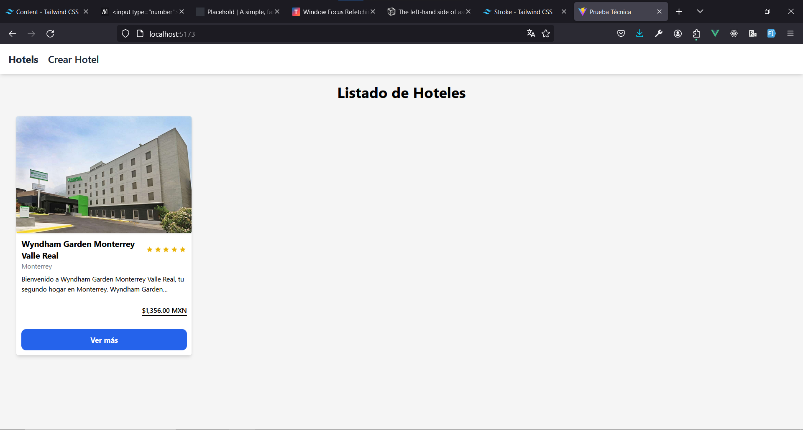
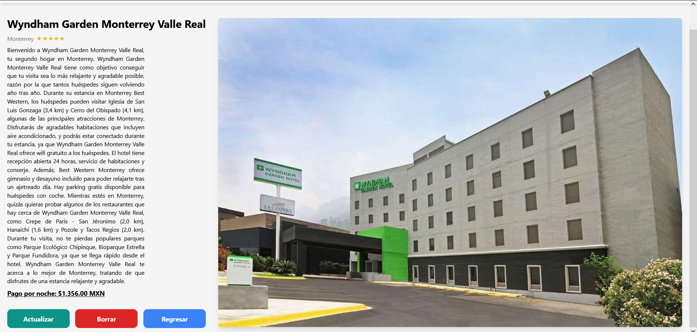
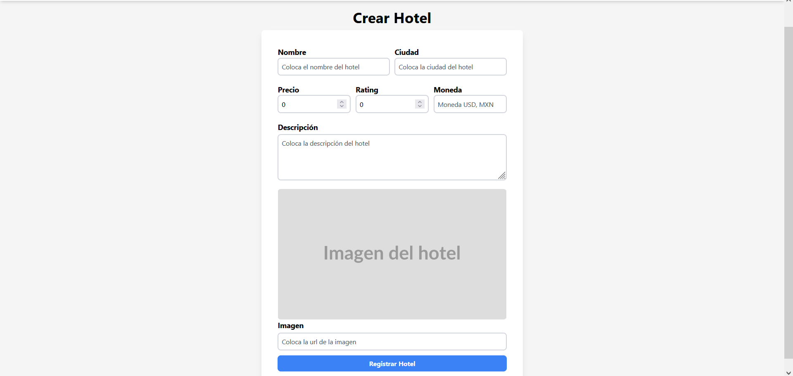
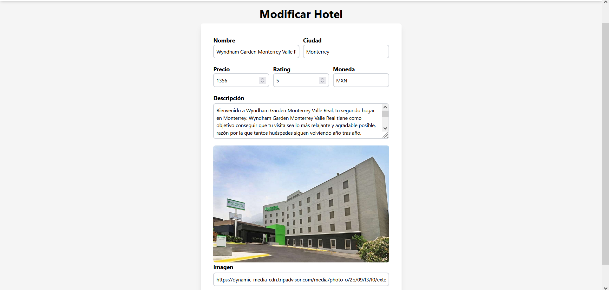
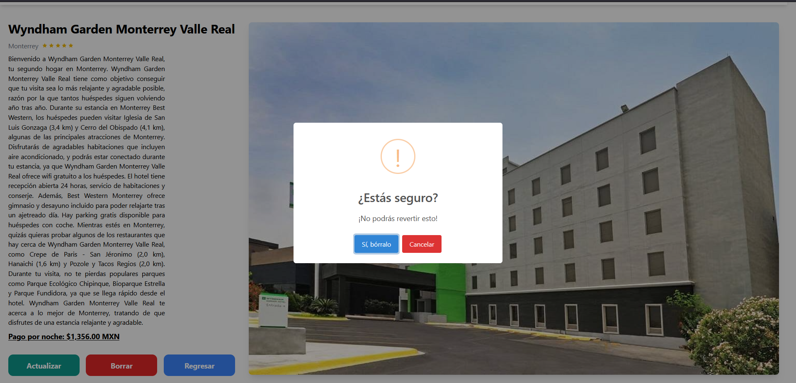

# Prueba Técnica

Para instalar las dependencias del proyecto, ejecutar el siguiente comando:

```bash
npm install
```

## Descripción

Las vistas para hoteles se ve de esta manera


Ver mas información de un hotel


Formulario de crear hoteles


Formulario de editar hoteles


Borrar Hotel

